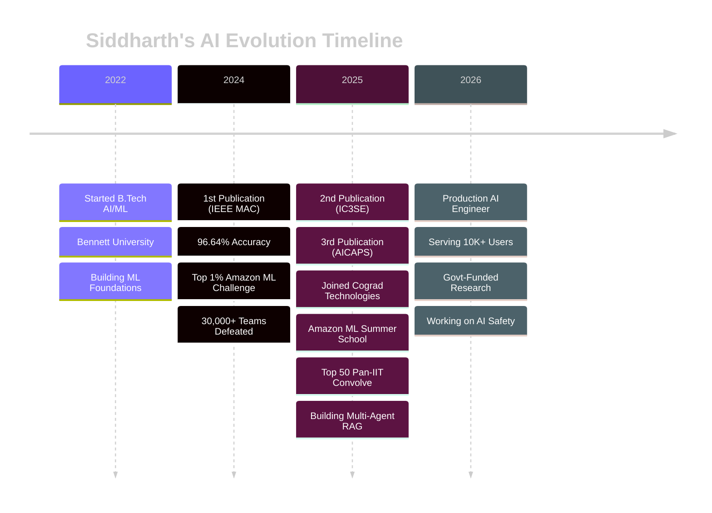

<!-- ============================================ -->
<!-- HERO SECTION - LANDING PAGE STYLE -->
<!-- ============================================ -->

<div align="center">


<!-- Animated Typing Effect -->


</div>

<div align="center">

<!-- Social Buttons - Portfolio Style -->
<table>
<tr>
<td align="center">
<a href="https://drive.google.com/file/d/1wUrlvMbia3wkqIJ8YKioV3vfbANxAr5p/view?usp=sharing">

</a>
</td>
<td align="center">
<a href="https://www.linkedin.com/in/siddharth-patel-505935251/">

</a>
</td>
<td align="center">
<a href="mailto:sidd707888@gmail.com">

</a>
</td>
<td align="center">
<a href="https://www.kaggle.com/sidd108">

</a>
</td>
<td align="center">
<a href="https://scholar.google.com/citations?user=dq-2pX8AAAAJ">

</a>
</td>
</tr>
</table>


</div>

<br/>

<!-- ============================================ -->
<!-- WHO AM I - ABOUT SECTION -->
<!-- ============================================ -->

<div align="center">

## 🎯 WHO AM I?

<table>
<tr>
<td width="60%" align="left">

### AI Engineer & Researcher at Cograd Technologies

I don't just build AI models — I **deploy them at scale**. From publishing research papers to serving **10,000+ users** in production, I bridge the gap between cutting-edge research and real-world impact.

**Currently:** Building multi-agent RAG systems using LangGraph + CrewAI while pursuing B.Tech AI/ML at Bennett University (CGPA: **9.66/10**).

**Mission:** Making AI systems that are not just accurate, but **production-ready, scalable, and impactful**.

</td>
<td width="40%">
```yaml
name: Siddharth Patel
role: AI Engineer & Researcher
company: Cograd Technologies
location: Greater Noida, India

stats:
  publications: 3
  users_served: 10000+
  competitions_won: Top 1% (30K+ teams)
  cgpa: 9.66/10
  dean_list: 3x
  
focus:
  - Multi-Agent AI Systems
  - Production RAG Pipelines
  - LLM Fine-tuning
  - Computer Vision
  - Edge AI Deployment
```

</td>
</tr>
</table>

</div>

<br/>


<br/>

<!-- ============================================ -->
<!-- IMPACT METRICS - STATS DASHBOARD -->
<!-- ============================================ -->

<div align="center">

## 📊 IMPACT METRICS

<table>
<tr>
<td align="center" width="25%">


### 📚 Research Output
**3 Publications**

IEEE • AICAPS • IC3SE

90-96% Accuracy

</td>
<td align="center" width="25%">


### 🏆 Competition Wins
**Top 1% Nationwide**

Amazon ML Challenge

Pan-IIT Convolve

</td>
<td align="center" width="25%">


### 🚀 Production Scale
**10,000+ Users**

Azure Deployment

70% Faster Response

</td>
<td align="center" width="25%">


### 🎓 Academic Excellence
**9.66/10 CGPA**

Dean's List (3x)

Top 10% GATE 2025

</td>
</tr>
</table>

</div>

<br/>

<!-- ============================================ -->
<!-- GITHUB STATS - PERFORMANCE DASHBOARD -->
<!-- ============================================ -->

<div align="center">

## 💻 GITHUB PERFORMANCE

<table>
<tr>
<td width="50%">

</td>
<td width="50%">

</td>
</tr>
<tr>
<td width="50%">

</td>
<td width="50%">

</td>
</tr>
</table>

</div>

<br/>


<br/>

<!-- ============================================ -->
<!-- MY AI JOURNEY - INTERACTIVE TIMELINE -->
<!-- ============================================ -->

<div align="center">

## 🗺️ MY AI JOURNEY

### From Student to Production AI Engineer

</div>

<div align="center">


</div>

<div align="center">

### 🎯 Current Mission
```diff
- Past → Student Learning ML Basics
+ Present → Researcher & Engineer Deploying at Scale  
++ Future → AI Safety Researcher | Edge AI Specialist
```

</div>

<br/>


<br/>

<!-- ============================================ -->
<!-- PROJECTS - 3D CARD SHOWCASE -->
<!-- ============================================ -->

<div align="center">

## 🚀 FEATURED PROJECTS

### Production-Grade AI Systems

</div>

<br/>

<!-- Project 1: DataWhiz -->
<div align="center">

<details open>
<summary><h3>🔮 DataWhiz - Multi-Agent Text-to-SQL System</h3></summary>

<table>
<tr>
<td width="55%">


</td>
<td width="45%" align="left">

**🎯 THE PROBLEM**

Traditional Text-to-SQL fails with 200+ table databases and can't handle semantic queries.

**💡 THE SOLUTION**

Multi-agent system using GPT-4o + LangChain with vector-based schema retrieval and auto-correction.

**🔥 KEY INNOVATIONS**
- 3-agent orchestration system
- Semantic schema search (Qdrant)
- Automated visualization (LIDA)
- Query validation pipeline

</td>
</tr>
<tr>
<td colspan="2">

**📊 PERFORMANCE METRICS**

| Metric | Value | Status |
|--------|-------|--------|
| Database Scale | 200+ tables | ✅ Production |
| Query Accuracy | 85%+ | 🟢 Excellent |
| Response Time | <3 seconds | ⚡ Fast |
| Users Served | Azure Cloud | 🚀 Deployed |

**🛠️ TECH STACK**


**🔗 LINKS**  
[Live Demo](https://vsk-project.vercel.app/) • [GitHub](#) • [Technical Blog](#)

</td>
</tr>
</table>

</details>

</div>

<br/>

<!-- Project 2: Aurigen -->
<div align="center">

<details>
<summary><h3>💎 Aurigen - AI Jewelry Design with Stable Diffusion</h3></summary>

<table>
<tr>
<td width="55%">


</td>
<td width="45%" align="left">

**🎯 THE PROBLEM**

Jewelry design is time-consuming and limits creative exploration for customers.

**💡 THE SOLUTION**

SDXL + ControlNet + Custom LoRA fine-tuned on 6,000 jewelry images.

**🔥 KEY INNOVATIONS**
- Custom LoRA training
- ControlNet style control
- FP16 quantization (3x speedup)
- Interactive Streamlit UI

</td>
</tr>
<tr>
<td colspan="2">

**📊 PERFORMANCE METRICS**

| Metric | Value | Improvement |
|--------|-------|-------------|
| Inference Time | 8 seconds | ⚡ 3x Faster |
| Image Quality | 512x512 HD | 🎨 High-Fidelity |
| Memory Usage | 40% Reduction | 💾 Optimized |
| User Experience | Real-time | ✨ Interactive |

**🛠️ TECH STACK**


**🔗 LINKS**  
[GitHub Repo](https://github.com/sidd707/Aurigen-AI-Powered-Jewelry-Design-Studio) • [Demo](#) • [Paper](#)

</td>
</tr>
</table>

</details>

</div>

<br/>

<!-- Project 3: Live Doubt Management -->
<div align="center">

<details>
<summary><h3>💬 AI Live Class Doubt Management System</h3></summary>

<table>
<tr>
<td width="55%">


</td>
<td width="45%" align="left">

**🎯 THE PROBLEM**

1000+ students in live classes = impossible to handle doubts manually.

**💡 THE SOLUTION**

Real-time NLP system with intelligent clustering and async LLM pipeline.

**🔥 KEY INNOVATIONS**
- pgvector semantic clustering
- Redis priority queue
- Context-aware answers (85%+)
- Chrome extension integration

</td>
</tr>
<tr>
<td colspan="2">

**📊 PERFORMANCE METRICS**

| Metric | Value | Impact |
|--------|-------|--------|
| Response Time | 70% Faster | ⚡ Significant |
| Answer Accuracy | 85%+ | 🎯 High-Quality |
| Concurrent Doubts | 100+ | 🚀 Scalable |
| Architecture | Event-Driven | ⚙️ Modern |

**🛠️ TECH STACK**


**🔗 LINKS**  
[GitHub](#) • [Chrome Extension](#) • [System Design](#)

</td>
</tr>
</table>

</details>

</div>

<br/>

<!-- Project 4: Dehazing System -->
<div align="center">

<details>
<summary><h3>🌫️ Government-Funded Fog Removal System</h3></summary>

<table>
<tr>
<td width="55%">


</td>
<td width="45%" align="left">

**🎯 THE PROBLEM**

Winter fog causes road accidents due to poor visibility for traffic cameras.

**💡 THE SOLUTION**

Custom CNN + YOLO v8 with ONNX optimization for edge deployment.

**🔥 KEY INNOVATIONS**
- Custom fog dataset creation
- Physics + DL hybrid approach
- Real-time 30 FPS inference
- Edge device deployment

</td>
</tr>
<tr>
<td colspan="2">

**📊 PERFORMANCE METRICS**

| Metric | Value | Status |
|--------|-------|--------|
| Visibility Boost | 85%+ | 🟢 Excellent |
| Object Detection | 90%+ mAP | 🎯 Maintained |
| Inference Speed | 30 FPS | ⚡ Real-time |
| Deployment | Raspberry Pi / Jetson | 📱 Edge-Ready |

**🛠️ TECH STACK**


**🔗 LINKS**  
[Research Paper (In Progress)](#) • [Dataset](#) • [Demo](#)

</td>
</tr>
</table>

</details>

</div>

<br/>


<br/>

<!-- ============================================ -->
<!-- RESEARCH PUBLICATIONS -->
<!-- ============================================ -->

<div align="center">

## 📚 RESEARCH PUBLICATIONS

### Peer-Reviewed Papers in Top Venues

<table>
<tr>
<td align="center" width="33%">


### Paper #1
**Hinglish Abusive Comment Detection Using Transformer Models**

📍 **Venue:** AICAPS 2026  
📊 **Accuracy:** 90% F1-Score  
🗃️ **Dataset:** 700K+ code-mixed  
🔧 **Model:** mBERT/XLM-R + BiGRU  


</td>
<td align="center" width="33%">


### Paper #2
**Deep Learning-Based Brain Tumor Detection**

📍 **Venue:** IC3SE 2025  
📊 **Accuracy:** 94%  
🗃️ **Data:** Multimodal MRI  
🔧 **Innovation:** Interpretable CNN  


</td>
<td align="center" width="33%">


### Paper #3
**CNN-Based Skin Disease & Cancer Classification**

📍 **Venue:** MAC 2024 (IEEE)  
📊 **Accuracy:** 96.64%  
🗃️ **Classes:** 57 diseases  
🔧 **Link:** [IEEE Xplore](https://ieeexplore.ieee.org/document/10837323)  


</td>
</tr>
</table>

</div>

<br/>


<br/>

<!-- ============================================ -->
<!-- SKILLS - TABBED/CARD LAYOUT -->
<!-- ============================================ -->

<div align="center">

## 🛠️ TECH STACK & EXPERTISE

### What Recruiters Are Looking For in 2026

</div>

<div align="center">

<details open>
<summary><h3>🤖 AI/ML & Deep Learning</h3></summary>

<br/>

**Frameworks & Libraries**


**Deep Learning Architectures**


**Specialized Models**


</details>

<details>
<summary><h3>🦾 GenAI & LLM Engineering (🔥 HOT IN 2026)</h3></summary>

<br/>

**LLM Platforms & APIs**


**LLM Frameworks & Tools**


**RAG & Vector Databases**


**LLM Techniques**


</details>

<details>
<summary><h3>☁️ MLOps & Cloud (Production-Grade)</h3></summary>

<br/>

**Cloud Platforms**


**Container & Orchestration**


**API Frameworks**


**Caching & Queues**


**Monitoring & Logging**


</details>

<details>
<summary><h3>🗄️ Databases & Data Engineering</h3></summary>

<br/>

**SQL Databases**


**NoSQL Databases**


**Graph & Analytics**


</details>

<details>
<summary><h3>💻 Programming & Tools</h3></summary>

<br/>

**Languages**


**Version Control & CI/CD**


**Development Tools**


</details>

<details>
<summary><h3>🎨 Computer Vision & Image AI</h3></summary>

<br/>

**CV Libraries**


**Object Detection & Segmentation**


**Generative AI**


</details>

<details>
<summary><h3>📊 Data Science & Analytics</h3></summary>

<br/>

**Data Processing**


**Visualization**


</details>

</div>

<br/>


<br/>

<!-- ============================================ -->
<!-- CURRENT FOCUS -->
<!-- ============================================ -->

<div align="center">

## 🔭 CURRENTLY EXPLORING

</div>
```python
research_focus = {
    "hot_topics_2026": [
        "AI Safety & Constitutional AI",
        "Reinforcement Learning from Human Feedback (RLHF)",
        "Multi-Modal Large Language Models",
        "Edge AI & On-Device Model Optimization",
        "Graph Neural Networks (GNNs)",
        "Agentic Workflows & Multi-Agent Coordination"
    ],
    
    "current_projects": [
        "Multi-Agent RAG Systems @ Cograd Technologies",
        "Government-Funded Fog Removal for Road Safety",
        "Edge AI Optimization (GGUF quantization)",
        "Research on Physics-Informed Neural Networks"
    ],
    
    "learning_right_now": [
        "Advanced RL algorithms (PPO, SAC, A3C)",
        "Constitutional AI techniques",
        "Efficient model quantization (GGUF, GPTQ, AWQ)",
        "Distributed training at scale (DeepSpeed, FSDP)"
    ],
    
    "open_to_collaborate": [
        "Research paper co-authorship",
        "Open-source ML projects",
        "Hackathon team-ups",
        "Technical content writing",
        "Conference presentations"
    ]
}

for key, value in research_focus.items():
    print(f"✓ {key}: {len(value)} active areas")
```

<br/>


<br/>

<!-- ============================================ -->
<!-- SNAKE ANIMATION -->
<!-- ============================================ -->

<div align="center">

## 🐍 CONTRIBUTION SNAKE


</div>

<br/>

<!-- ============================================ -->
<!-- CONTACT & COLLABORATION -->
<!-- ============================================ -->

<div align="center">

## 📬 LET'S BUILD SOMETHING INTELLIGENT

### I'm Open To

</div>

<div align="center">

<table>
<tr>
<td align="center" width="33%">


### Research Collaborations
Co-authoring papers in  
NLP • Computer Vision  
Multi-Agent AI

</td>
<td align="center" width="33%">


### Open Source
Contributing to  
ML frameworks  
Production AI tools

</td>
<td align="center" width="33%">


### Hackathons
Team-ups for  
AI/ML competitions  
Building MVPs

</td>
</tr>
</table>

</div>

<br/>

<div align="center">

### 📧 CONTACT ME

<table>
<tr>
<td align="center">
<a href="mailto:sidd707888@gmail.com">

</a>
</td>
<td align="center">
<a href="https://www.linkedin.com/in/siddharth-patel-505935251/">

</a>
</td>
<td align="center">
<a href="https://github.com/sidd707">

</a>
</td>
</tr>
</table>

<br/>

**💬 Quick Links**

[Resume](https://drive.google.com/file/d/1wUrlvMbia3wkqIJ8YKioV3vfbANxAr5p/view?usp=sharing) • 
[Google Scholar](https://scholar.google.com/citations?user=dq-2pX8AAAAJ) • 
[LeetCode](https://leetcode.com/u/sidd888/) • 
[Kaggle](https://www.kaggle.com/sidd108)

</div>

<br/>

<!-- ============================================ -->
<!-- FOOTER -->
<!-- ============================================ -->

<div align="center">


### 💭 Philosophy

> *"The best way to predict the future is to invent it."* — Alan Kay

**Building AI systems that matter, one model at a time.** 🚀

<br/>

<sub>⚡ Last Updated: January 2026 | v4.0 Portfolio Edition</sub>


</div>
