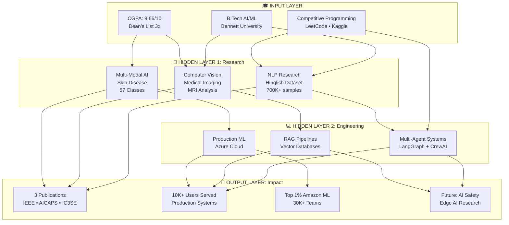
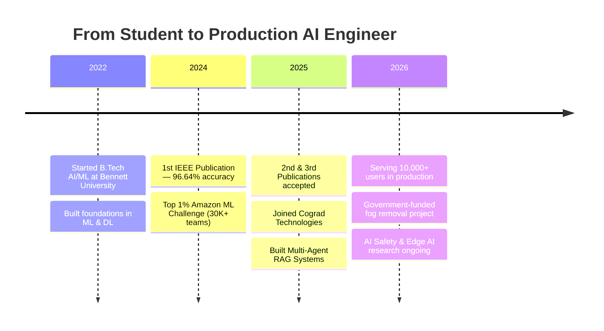

<div align="center">


<br/>

[](https://drive.google.com/file/d/15dXSHIhakItE5DpxD0Ri5baQK-8S1Kvg/view?usp=sharing)
[](https://www.linkedin.com/in/siddharth-patel-505935251/)
[](mailto:sidd707888@gmail.com)
[](https://leetcode.com/u/sidd888/)
[](https://www.kaggle.com/sidd108)
[](https://scholar.google.com/citations?user=dq-2pX8AAAAJ)

<br/>


</div>

<br/>

---

<h2 align="center">🎯 About Me</h2>

```python
class SiddharthPatel:
    def __init__(self):
        self.role       = "AI Engineer & ML Researcher"
        self.company    = "Cograd Technologies"
        self.education  = "B.Tech AI/ML | Bennett University"
        self.cgpa       = "9.66/10 | Dean's List (3x)"
        self.location   = "Greater Noida, India"

    def current_work(self):
        return {
            "building"   : "Multi-Agent RAG Systems",
            "serving"    : "10,000+ users on Azure",
            "researching": "AI Safety & Edge AI",
            "tech_stack" : ["LangChain", "LangGraph", "PyTorch", "FastAPI"]
        }

    def achievements(self):
        return {
            "publications": 3,
            "competitions": "Top 1% Amazon ML (30K+ teams)",
            "accuracy"    : "90–96% across research projects",
            "dean_list"   : "3 semesters (Top 5%)"
        }

me = SiddharthPatel()
print(f"🚀 Currently: {me.current_work()}")
print(f"🏆 Achievements: {me.achievements()}")
```

<p align="center">
<strong>I don't just build AI models — I deploy them at scale.</strong><br/>
From publishing papers to serving production systems, I bridge research and real-world impact.
</p>

<br/>

---

<h2 align="center">🧠 Neural Network: My AI Journey</h2>



<br/>

---

<h2 align="center">🗺️ My AI Journey Timeline</h2>



<br/>

---

<h2 align="center">📊 GitHub Performance Dashboard</h2>

<div align="center">


<br/><br/>


</div>

<br/>

---

<h2 align="center">🚀 Featured Projects</h2>

### 🔮 DataWhiz — Multi-Agent Text-to-SQL System

<table>
<tr>
<td width="60%">

**The Challenge:** Traditional Text-to-SQL fails with 200+ table databases.

**The Solution:** Multi-agent system using GPT-4o + LangChain with:
- Semantic schema retrieval via Qdrant vector DB
- 3-agent orchestration: Generator → Validator → Optimizer
- Automated visualization powered by LIDA
- Self-correcting query pipeline

**Impact:**
- 📊 Handles 200+ table databases seamlessly
- ⚡ 85%+ accuracy on complex queries
- 🚀 Deployed & live on Azure Cloud
- 🎯 Sub-3-second response time

</td>
<td width="40%">

**Tech Stack:**


**Links:**
🔗 [Live Demo](https://vsk-project.vercel.app/)
💻 [GitHub](#)

</td>
</tr>
</table>

---

### 💎 Aurigen — AI Jewelry Design Studio

<table>
<tr>
<td width="60%">

**The Challenge:** Jewelry design requires expert artists and is time-consuming.

**The Solution:** SDXL + ControlNet + Custom LoRA pipeline:
- Fine-tuned on 6,000 curated jewelry images
- ControlNet for style & structural control
- FP16 quantization delivering 3× speedup
- Interactive Streamlit generation interface

**Impact:**
- ⚡ 8-second inference (down from 24s)
- 🎨 High-quality 512×512 designs
- 💾 40% memory reduction
- ✨ Real-time interactive generation

</td>
<td width="40%">

**Tech Stack:**


**Links:**
💻 [GitHub](https://github.com/sidd707/Aurigen-AI-Powered-Jewelry-Design-Studio)

</td>
</tr>
</table>

---

### 💬 AI Live Class Doubt Management

<table>
<tr>
<td width="60%">

**The Challenge:** 1,000+ students, real-time doubts get lost in noise.

**The Solution:** NLP + Vector clustering system:
- pgvector for semantic similarity matching
- Redis priority queue for real-time processing
- Async LLM pipeline with GPT-4
- Chrome extension for live class chat integration

**Impact:**
- ⚡ 70% faster response time
- 🎯 85%+ context-aware accuracy
- 🚀 100+ concurrent doubts handled
- 📊 Event-driven microservices architecture

</td>
<td width="40%">

**Tech Stack:**


**Links:**
💻 [GitHub](#)

</td>
</tr>
</table>

---

### 🌫️ Government-Funded Fog Removal System

<table>
<tr>
<td width="60%">

**The Challenge:** Winter fog is a leading cause of road accidents in North India.

**The Solution:** Real-time Computer Vision safety pipeline:
- Custom CNN dehazing network
- YOLOv8 for multi-class object detection
- ONNX optimization for edge deployment
- Custom annotated winter fog dataset

**Impact:**
- 🟢 85%+ visibility improvement
- 🎯 90%+ mAP maintained post-dehazing
- ⚡ 30 FPS real-time inference
- 📱 Runs on Raspberry Pi & Jetson Nano

</td>
<td width="40%">

**Tech Stack:**


**Status:** 🔄 In Progress
**Paper:** Coming Soon

</td>
</tr>
</table>

<br/>

---

<h2 align="center">📚 Research Publications</h2>

<div align="center">

| # | Paper | Venue | Metric | Dataset | Status |
|---|-------|-------|--------|---------|--------|
| 3 | **Hinglish Abusive Comment Detection** | AICAPS 2026 | 90% F1 | 700K+ posts | ✅ Accepted |
| 2 | **Brain Tumor Detection via Multi-Modal MRI** | IC3SE 2025 | 94% Acc | Multi-modal MRI | ✅ Published |
| 1 | **Skin Disease Classification** | MAC 2024 (IEEE) | 96.64% Acc | 57 classes | ✅ [Published](https://ieeexplore.ieee.org/document/10837323) |

</div>

<br/>

---

<h2 align="center">🛠️ Tech Stack</h2>

<details open>
<summary><b>🤖 AI/ML & Deep Learning</b></summary>
<br/>


**Architectures:** Transformers · BERT · GPT · CNNs · RNNs · GANs · Diffusion Models · YOLO · ControlNet · LoRA / QLoRA

</details>

<details>
<summary><b>🦾 GenAI & LLM Engineering</b></summary>
<br/>


**Vector Databases:**


**Techniques:** RAG · Multi-Agent Systems · Fine-tuning (LoRA, QLoRA) · Prompt Engineering · Function Calling · Agentic Workflows

</details>

<details>
<summary><b>☁️ MLOps & Production</b></summary>
<br/>


**Advanced:** DeepSpeed · FSDP · GGUF · GPTQ · AWQ Quantization

</details>

<details>
<summary><b>🗄️ Databases</b></summary>
<br/>


</details>

<details>
<summary><b>💻 Languages & Tools</b></summary>
<br/>


</details>

<br/>

---

<h2 align="center">🏆 Achievements</h2>

<div align="center">

| Category | Achievement |
|----------|-------------|
| 🥇 **Competitions** | Top 1% Amazon ML Challenge (30K+ teams) · Top 50 Pan-IIT · 1st Place Inspire Hackathon |
| 🎓 **Academic** | 9.66/10 CGPA · Dean's List (3 semesters) · Top 10% GATE 2025 |
| 📚 **Research** | 3 Publications (IEEE · IC3SE · AICAPS) · 90–96% Accuracy · 700K+ sample dataset |
| 💼 **Industry** | 10K+ Users Served · Azure Production Deployment · 70% Performance Boost |

</div>

<br/>

---

<h2 align="center">🔭 Currently Exploring</h2>

```yaml
research_interests:
  - AI Safety & Constitutional AI
  - Reinforcement Learning from Human Feedback (RLHF)
  - Multi-Modal Large Language Models
  - Edge AI & Model Optimization
  - Graph Neural Networks (GNNs)

current_projects:
  - Multi-Agent RAG Systems @ Cograd Technologies
  - Government-Funded Real-Time Fog Removal
  - Edge AI Optimization (GGUF quantization)
  - Physics-Informed Neural Networks Research

learning:
  - Advanced RL algorithms (PPO, SAC, A3C)
  - Constitutional AI techniques
  - Efficient quantization (GGUF, GPTQ, AWQ)
  - Distributed training (DeepSpeed, FSDP)
```

<br/>

---

<h2 align="center">🐍 Contribution Snake</h2>

<div align="center">


</div>

<br/>

---

<h2 align="center">📬 Let's Connect</h2>

<p align="center">
<strong>Open to research collaborations, open-source contributions, and building intelligent systems.</strong>
</p>

<div align="center">

[](mailto:sidd707888@gmail.com)
[](https://www.linkedin.com/in/siddharth-patel-505935251/)
[](https://github.com/sidd707)

<br/>

**Quick Links:**
[Resume](https://drive.google.com/file/d/1wUrlvMbia3wkqIJ8YKioV3vfbANxAr5p/view?usp=sharing) ·
[Google Scholar](https://scholar.google.com/citations?user=dq-2pX8AAAAJ) ·
[LeetCode](https://leetcode.com/u/sidd888/) ·
[Kaggle](https://www.kaggle.com/sidd108)

</div>

<br/>

---

<div align="center">


<h3>💭 Philosophy</h3>

> *"The best way to predict the future is to invent it."* — Alan Kay

**Building AI systems that matter, one model at a time.** 🚀

<br/>


<sub>Last Updated: March 2026 · v4.2</sub>

</div>
