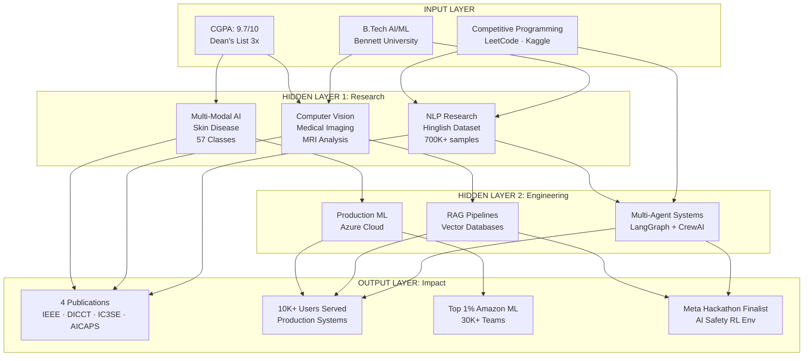
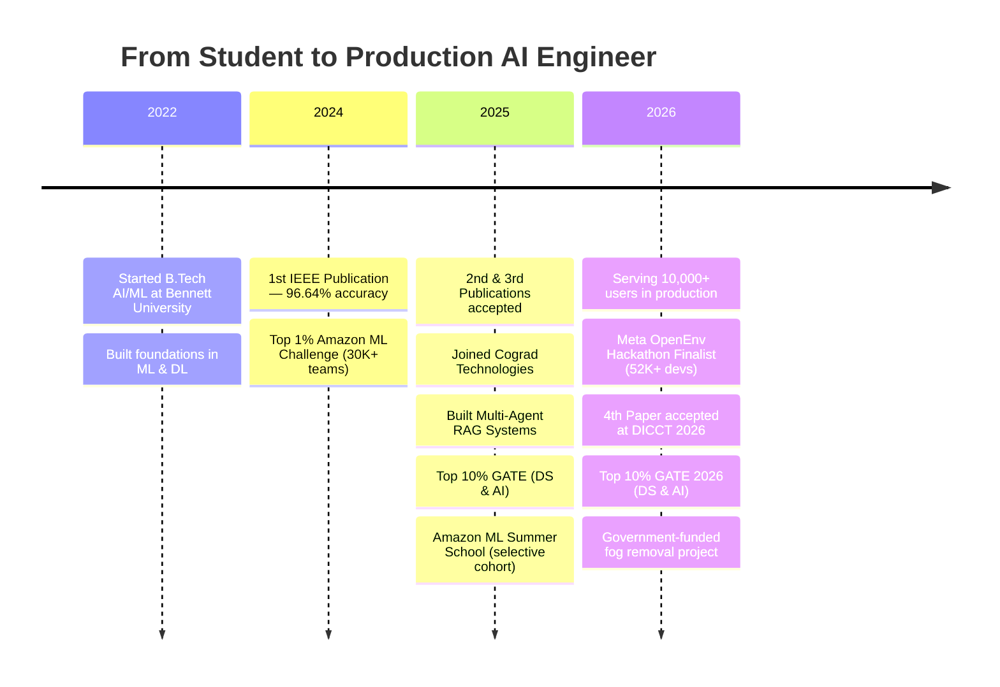

<div align="center">


<br/>

[](https://drive.google.com/file/d/10bTQX5Z9yGfry3beiizBHnnfP9uPlOgk/view?usp=sharing)
[](https://www.linkedin.com/in/siddharth-patel-505935251/)
[](mailto:sidd707888@gmail.com)
[](https://leetcode.com/u/sidd888/)
[](https://www.kaggle.com/sidd108)
[](https://scholar.google.com/citations?user=dq-2pX8AAAAJ)

<br/>


</div>

<br/>

---

<div align="center">

## Meta PyTorch OpenEnv Hackathon — Round 1 Finalist

<table>
<tr>
<td align="center">


<br/><br/>


<br/><br/>

**Built [SafeAct-Env](https://github.com/sidd707/my-openenv)** — an RL environment that trains AI agents to distinguish reversible from irreversible actions.
5 real-world tasks · 164 tests · GPT-4.1 baseline avg **0.82** · Deployed on [HuggingFace Spaces](https://huggingface.co/spaces/Sarthak4156/safeact-env)

<br/>

[](https://github.com/sidd707/my-openenv)
[](https://huggingface.co/spaces/Sarthak4156/safeact-env)

</td>
</tr>
</table>

**Team Peaky Blinders** — Siddharth Patel & [Sarthak Chauhan](https://github.com/Sarthak4156)

</div>

<br/>

---

<h2 align="center">About Me</h2>

```python
class SiddharthPatel:
    def __init__(self):
        self.role       = "AI Engineer & ML Researcher"
        self.company    = "Cograd Technologies"
        self.education  = "B.Tech AI/ML | Bennett University"
        self.cgpa       = "9.7/10 | Dean's List (3x — Top 2%)"
        self.location   = "Greater Noida, India"

    def current_work(self):
        return {
            "building"   : "Multi-Agent RAG Systems & Agentic AI",
            "serving"    : "10,000+ users on Azure",
            "researching": "AI Safety & Edge AI",
            "tech_stack" : ["LangGraph", "CrewAI", "PyTorch", "FastAPI"]
        }

    def achievements(self):
        return {
            "hackathon"   : "Meta OpenEnv Finalist (52K+ devs)",
            "publications": 4,
            "competitions": "Top 1% Amazon ML (30K+ teams)",
            "gate"        : "Top 10% GATE 2025 & 2026",
            "dean_list"   : "3 semesters (Top 2%)"
        }

me = SiddharthPatel()
```

<p align="center">
<strong>I don't just build AI models — I deploy them at scale.</strong><br/>
From publishing papers to serving production systems, I bridge research and real-world impact.
</p>

<br/>

---

<h2 align="center">Neural Network: My AI Journey</h2>



<br/>

---

<h2 align="center">My AI Journey Timeline</h2>



<br/>

---

<h2 align="center">GitHub Performance Dashboard</h2>

<div align="center">


<br/><br/>


</div>

<br/>

---

<h2 align="center">Featured Projects</h2>

### SafeAct-Env — AI Safety RL Environment

<table>
<tr>
<td width="60%">

**The Challenge:** AI agents cause irreversible damage in production — wiping drives, deleting databases, sending unrecoverable actions — and no RL training environment existed for this problem.

**The Solution:** OpenEnv-compatible RL environment with:
- 5 real-world tasks (File Cleanup, DB Maintenance, Server Migration, Medical Triage, Cloud Infra)
- Hidden risk labels (safe/risky/irreversible) — agent never sees them
- Escalation mechanic — agents must ask before dangerous actions
- Trap actions — sound safe but are catastrophic
- 164 deterministic tests with seeded randomization

**Impact:**
- Selected from 52,000+ developers · Top 800 / 31,000+ teams
- GPT-4.1 baseline averages 0.82 across all tasks
- Full Docker deployment · Live on HuggingFace Spaces

</td>
<td width="40%">

**Tech Stack:**


[](https://github.com/sidd707/my-openenv)
[](https://huggingface.co/spaces/Sarthak4156/safeact-env)

</td>
</tr>
</table>

---

### KVS Query — B2B Agentic Text-to-SQL Platform

<table>
<tr>
<td width="60%">

**The Challenge:** Government school databases have 200+ tables — traditional Text-to-SQL fails, and manual querying doesn't scale for B2B enterprise clients.

**The Solution:** Two distinct model architectures built & benchmarked:

**Architecture 1 — Multi-Agent Pipeline:**
- LangGraph-orchestrated agents: Schema Retriever → Query Generator → Validator → Optimizer
- Schema-aware semantic retrieval via Qdrant vector DB
- Self-correcting query loop with auto-retry

**Architecture 2 — Direct Multi-Model Pipeline:**
- Sequential pipeline chaining multiple specialized models
- Each stage (schema mapping, SQL generation, validation, visualization) handled by a dedicated model
- Auto-visualization powered by LIDA

**Impact:**
- Handles 200+ table databases seamlessly
- 85%+ accuracy on complex queries
- Live in production at [vskai.cograd.in](https://vskai.cograd.in/) on Azure
- Sub-3-second response time · B2B API for enterprise clients

</td>
<td width="40%">

**Tech Stack:**


[](https://vskai.cograd.in/)
[](https://github.com/sidd707/Cograd-RAG-Based-Retrieval-)

</td>
</tr>
</table>

---

### Aurigen — AI Jewelry Design Studio

<table>
<tr>
<td width="60%">

**The Challenge:** Jewelry design requires expert artists and is time-consuming.

**The Solution:** SDXL + ControlNet + Custom LoRA pipeline:
- Fine-tuned on 6,000 curated jewelry images
- ControlNet for style & structural control
- FP16 quantization delivering 3x speedup
- Interactive Streamlit generation interface

**Impact:**
- 8-second inference (down from 24s)
- High-quality 512x512 designs
- 40% memory reduction
- Real-time interactive generation

</td>
<td width="40%">

**Tech Stack:**


[](https://github.com/sidd707/Aurigen-AI-Powered-Jewelry-Design-Studio)

</td>
</tr>
</table>

---

### AI-Powered Live Class Doubt Management

<table>
<tr>
<td width="60%">

**The Challenge:** 1,000+ students, real-time doubts get lost in noise during live classes.

**The Solution:** NLP + Vector clustering system:
- pgvector semantic clustering auto-resolves 70-80% of doubts
- Redis priority queue for real-time processing
- Async LLM pipeline with GPT-4 at 85%+ accuracy
- Chrome extension for live class chat integration
- Building B2B API wrapper for EdTech platforms

**Impact:**
- 70% faster teacher response time
- 100+ concurrent doubts handled with de-duplication
- Priority clustering dashboard for teachers
- Event-driven microservices architecture

</td>
<td width="40%">

**Tech Stack:**


[](https://github.com/sidd707/streammind-live-qa)

</td>
</tr>
</table>

---

### Government-Funded Fog Removal System

<table>
<tr>
<td width="60%">

**The Challenge:** Winter fog is a leading cause of road accidents in North India — critical for ADAS and autonomous driving.

**The Solution:** Real-time Computer Vision safety pipeline:
- Custom 1,000+ video domain-specific fog/haze dataset
- Novel encoder-decoder dehazing architecture
- YOLOv8 + ONNX for edge deployment
- Targets dense-fog Indian highway scenarios

**Impact:**
- 85%+ visibility improvement
- 90%+ mAP maintained post-dehazing
- 30+ FPS real-time edge inference
- Runs on Raspberry Pi & Jetson Nano
- Paper accepted at **DICCT 2026**

</td>
<td width="40%">

**Tech Stack:**


**Mentor:** Dr. Dileep Kumar Yadav
**Status:** Paper Accepted at DICCT 2026

</td>
</tr>
</table>

<br/>

---

<h2 align="center">Research Publications</h2>

<div align="center">

| # | Paper | Venue | Metric | Status |
|---|-------|-------|--------|--------|
| 4 | **Image & Video Dehazing for Dense-Fog Indian Highways** | DICCT 2026 | 30+ FPS Edge | Accepted |
| 3 | **Hinglish Abusive Comment Detection** | AICAPS 2026 | 90% F1 | Accepted |
| 2 | **Brain Tumor Detection via Multi-Modal MRI** | IC3SE 2025 | 97.7% Acc | [Published](https://github.com/sidd707/Brain-tumor-Detection) |
| 1 | **CNN-Based Skin Disease & Cancer Classification** | IEEE MAC 2024 | 96.64% Acc | [Published](https://ieeexplore.ieee.org/document/10837323) |

</div>

<br/>

---

<h2 align="center">Tech Stack</h2>

<div align="center">

### AI/ML & Deep Learning


**Architectures:** Transformers · BERT · GPT · CNNs · RNNs · GANs · Diffusion Models · YOLO · ControlNet · LoRA / QLoRA

---

### Agentic AI & LLM Engineering


**Vector Databases:**


**Techniques:** RAG · Multi-Agent Systems · Fine-tuning (LoRA, QLoRA, GGUF, RLHF) · MCP · Claude Agent SDK · Context Engineering · Agentic Loops

---

### Cloud, MLOps & Production


---

### Databases


---

### Languages & Tools


</div>

<br/>

---

<h2 align="center">Achievements & Certifications</h2>

<div align="center">

| Category | Achievement |
|----------|-------------|
| **Hackathons** | **Meta OpenEnv Finalist** (Top 800 / 31K+ teams) · **1st Place** Inspire Awards (6K+ teams) · Top 50 Convolve 3.0 Pan-IIT (4K+ teams) · Top 10 HackEye (300+ teams) |
| **Competitions** | **Top 1%** Amazon ML Challenge (30K+ teams) · Amazon ML Summer School 2025 (selective cohort) |
| **Academic** | 9.7/10 CGPA · Dean's List (3 semesters — Top 2%) · Top 10% GATE 2025 & 2026 (DS & AI) |
| **Research** | 4 Papers (IEEE · IC3SE · AICAPS · DICCT) · 90-97% Accuracy · 700K+ sample dataset |
| **Industry** | 10K+ Users Served · Azure Production · 70% Performance Boost |
| **Certifications** | Deep Learning Specialization (DeepLearning.AI) · NLP Specialization (DeepLearning.AI) |
| **Leadership** | Hackathon Organizer — Cograd x IIT Bombay Techfest · 1,500+ participants · Mentored 100+ students |

</div>

<br/>

---

<h2 align="center">Currently Exploring</h2>

```yaml
research_interests:
  - AI Safety & Irreversible Action Prevention
  - Reinforcement Learning from Human Feedback (RLHF)
  - Multi-Modal Large Language Models
  - Edge AI & Model Optimization
  - Physics-Informed Neural Networks (PINNs)

current_projects:
  - Student Job Engine — 7-Agent AI Resume Optimizer (LangGraph + Claude API)
  - Multi-Agent RAG Systems @ Cograd Technologies
  - Government-Funded Real-Time Fog Removal (DICCT 2026)
  - Edge AI Optimization (GGUF, GPTQ, AWQ quantization)

learning:
  - Advanced RL algorithms (PPO, SAC, A3C)
  - Constitutional AI techniques
  - MCP (Model Context Protocol) & Agentic Workflows
  - Distributed training (DeepSpeed, FSDP)
```

<br/>

---

<h2 align="center">Let's Connect</h2>

<p align="center">
<strong>Open to research collaborations, open-source contributions, and building intelligent systems.</strong>
</p>

<div align="center">

[](mailto:sidd707888@gmail.com)
[](https://www.linkedin.com/in/siddharth-patel-505935251/)
[](https://github.com/sidd707)

<br/>

**Quick Links:**
[Resume](https://drive.google.com/file/d/10bTQX5Z9yGfry3beiizBHnnfP9uPlOgk/view?usp=sharing) ·
[Google Scholar](https://scholar.google.com/citations?user=dq-2pX8AAAAJ) ·
[LeetCode](https://leetcode.com/u/sidd888/) ·
[Kaggle](https://www.kaggle.com/sidd108)

</div>

<br/>

---

<div align="center">


<h3>Philosophy</h3>

> *"The best way to predict the future is to invent it."* — Alan Kay

**Building AI systems that matter, one model at a time.**

<br/>


<sub>Last Updated: April 2026</sub>

</div>
