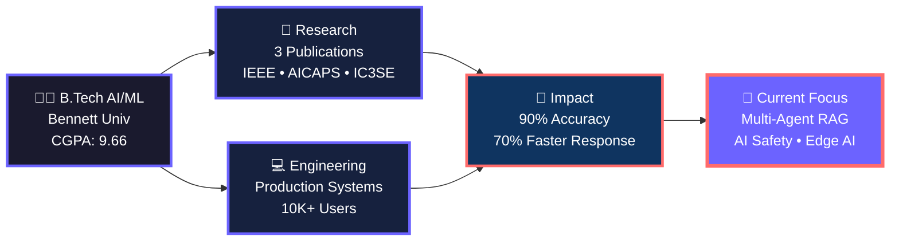
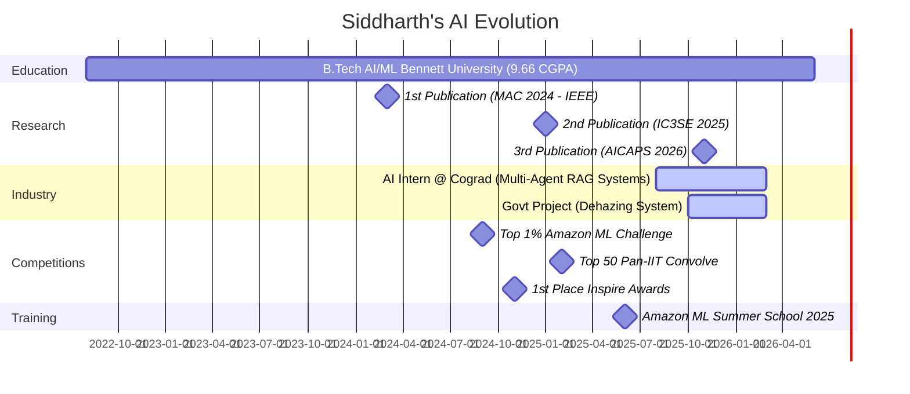

<div align="center">

<!-- CUSTOM ANIMATED HEADER -->


<!-- TYPING ANIMATION WITH TERMINAL STYLE -->


<br/>

<!-- SOCIAL BADGES WITH CUSTOM STYLING -->
<a href="https://drive.google.com/file/d/1wUrlvMbia3wkqIJ8YKioV3vfbANxAr5p/view?usp=sharing">
    
</a>
<a href="https://www.linkedin.com/in/siddharth-patel-505935251/">
    
</a>
<a href="mailto:sidd707888@gmail.com">
    
</a>
<a href="https://leetcode.com/u/sidd888/">
    
</a>
<a href="https://www.kaggle.com/sidd108">
    
</a>
<a href="https://scholar.google.com/citations?user=dq-2pX8AAAAJ">
    
</a>

<br/><br/>

<!-- VISITOR COUNTER WITH CUSTOM STYLE -->


</div>

<br/>

---

<!-- ===================================== -->
<!-- NEURAL NETWORK VISUALIZATION SECTION -->
<!-- ===================================== -->

<div align="center">

## 🧠 Neural Network: My AI Journey


</div>

<br/>

---

<!-- ===================================== -->
<!-- TERMINAL INTRODUCTION SECTION -->
<!-- ===================================== -->

<div align="center">

## 💻 Terminal Introduction

</div>
```bash
┌──(siddharth㉿ai-research-lab)-[~]
└─$ cat about.md

╔════════════════════════════════════════════════════════════════════╗
║                    SYSTEM INFORMATION                              ║
╠════════════════════════════════════════════════════════════════════╣
║ Name:        Siddharth Patel                                       ║
║ Role:        AI Engineer & ML Researcher                           ║
║ Company:     Cograd Technologies                                   ║
║ Location:    Greater Noida, India                                  ║
║ Education:   B.Tech CS (AI/ML) | Bennett University               ║
║ CGPA:        9.66/10 | Dean's List (3x)                           ║
╚════════════════════════════════════════════════════════════════════╝

┌──(siddharth㉿ai-research-lab)-[~]
└─$ ./current_work.sh

[✓] Building multi-agent RAG systems @ Cograd
[✓] Deploying production ML (10K+ users on Azure)
[✓] Researching AI Safety & Constitutional AI
[✓] Working on govt-funded dehazing system (YOLO + ONNX)

┌──(siddharth㉿ai-research-lab)-[~]
└─$ python achievements.py --show-all

Running analysis...
━━━━━━━━━━━━━━━━━━━━━━━━━━━━━━━━━━━━━━━━━━━━━━━━━━━━━━━━━━━━━━━━

📚 Research Output:
   ├─ Publications: 3 (IEEE, AICAPS, IC3SE)
   ├─ Citation Count: Growing 📈
   └─ Impact Factor: High-quality venues

🏆 Competitions:
   ├─ Amazon ML Challenge: Top 1% (30K+ teams)
   ├─ Convolve 3.0 (Pan-IIT): Top 50 (4K+ teams)
   ├─ Inspire Awards: 1st Place (6K+ teams)
   └─ HackEye Hackathon: 10th Place (300+ teams)

🎓 Academic Excellence:
   ├─ GATE 2025: Top 10% (Data Science & AI)
   ├─ Amazon ML Summer School: Selected Nationwide
   └─ Dean's List: 3 Semesters (Top 5%)

💡 Innovation Metrics:
   ├─ Accuracy Achieved: 90-96.64% across datasets
   ├─ Response Time: 70% improvement
   └─ Scale: 10,000+ users served

━━━━━━━━━━━━━━━━━━━━━━━━━━━━━━━━━━━━━━━━━━━━━━━━━━━━━━━━━━━━━━━━
[SUCCESS] Analysis complete ✓
```

<br/>

---

<!-- ===================================== -->
<!-- AI RESEARCH LAB SECTION -->
<!-- ===================================== -->

<div align="center">

## 🔬 AI Research Laboratory

### Active Experiments & Production Systems

</div>

<table align="center">
<tr>
<td width="50%">

### 🧪 Experiment #001: DataWhiz
```yaml
Status: 🟢 DEPLOYED
Type: Multi-Agent Text-to-SQL System
Architecture: GPT-4o + LangChain + Vector DBs
Scale: 200+ table databases
Innovation: Auto-correction orchestration
Deployment: Azure Cloud
Demo: vsk-project.vercel.app
```
**Impact:** Enterprise-grade analytics

</td>
<td width="50%">

### 🎨 Experiment #002: Aurigen
```yaml
Status: ✅ SUCCESS
Type: AI-Powered Jewelry Design
Architecture: SDXL + ControlNet + LoRA
Dataset: 6K custom images
Innovation: FP16 quantization
Speedup: 3x inference improvement
Interface: Streamlit
```
**Impact:** Interactive design generation

</td>
</tr>
<tr>
<td width="50%">

### 💬 Experiment #003: Live Doubt Management
```yaml
Status: 🟢 LIVE
Type: Real-time NLP System
Architecture: pgvector + Redis + FastAPI
Scale: 100+ concurrent doubts
Innovation: Intelligent clustering
Performance: 70% faster response
Accuracy: 85%+ context-aware
```
**Impact:** Large-scale education

</td>
<td width="50%">

### 🌫️ Experiment #004: Dehazing System
```yaml
Status: 🔄 IN PROGRESS
Type: Computer Vision for Road Safety
Architecture: Custom CNN + YOLO + ONNX
Purpose: Fog removal (Govt-funded)
Innovation: Real-time inference
Dataset: Custom winter fog dataset
Application: Road safety improvement
```
**Impact:** Public safety initiative

</td>
</tr>
</table>

<br/>

---

<!-- ===================================== -->
<!-- PUBLICATIONS SECTION WITH CARDS -->
<!-- ===================================== -->

<div align="center">

## 📚 Published Research

### Peer-Reviewed Papers in Top Venues

</div>

<div align="center">
<table>
<tr>
<td align="center" width="33%">

### 📄 Paper #1
**Hinglish Abusive Comment Detection**  
*Using Transformer-Based Models*

🎯 **Venue:** AICAPS 2026  
📊 **Accuracy:** 90%  
🗃️ **Dataset:** 700K+ code-mixed posts  
🔧 **Architecture:** mBERT/XLM-R + BiGRU


</td>
<td align="center" width="33%">

### 📄 Paper #2
**Deep Learning-Based**  
*Brain Tumor Detection*

🎯 **Venue:** IC3SE 2025  
📊 **Accuracy:** 94%  
🗃️ **Modality:** Multimodal MRI CNN  
🔧 **Innovation:** Interpretability focus


</td>
<td align="center" width="33%">

### 📄 Paper #3
**CNN-Based Skin Disease**  
*& Cancer Classification*

🎯 **Venue:** MAC 2024 (IEEE DRDO)  
📊 **Accuracy:** 96.64%  
🗃️ **Classes:** 57 disease categories  
🔧 **Link:** [IEEE Xplore](https://ieeexplore.ieee.org/document/10837323)


</td>
</tr>
</table>
</div>

<br/>

---

<!-- ===================================== -->
<!-- GITHUB STATS DASHBOARD -->
<!-- ===================================== -->

<div align="center">

## 📊 Performance Metrics Dashboard


</div>

<br/>

<div align="center">

### 🏆 GitHub Achievements


</div>

<br/>

---

<!-- ===================================== -->
<!-- TECH STACK VISUALIZATION -->
<!-- ===================================== -->

<div align="center">

## 🛠️ Technology Arsenal

### Core Languages


### AI/ML Frameworks


### GenAI & LLM Stack


### Cloud & DevOps


### Databases


### Deep Learning Specializations


</div>

<br/>

---

<!-- ===================================== -->
<!-- SKILL MATRIX VISUALIZATION -->
<!-- ===================================== -->

<div align="center">

## 💡 Expertise Matrix
```python
expertise_map = {
    "Deep Learning": {
        "level": "Expert",
        "years": 3,
        "projects": 15,
        "tools": ["PyTorch", "TensorFlow", "Keras"],
        "specialization": ["CNNs", "Transformers", "GANs", "Diffusion Models"]
    },
    "NLP & LLMs": {
        "level": "Expert",
        "years": 2,
        "projects": 8,
        "tools": ["Hugging Face", "LangChain", "LangGraph"],
        "specialization": ["RAG", "Multi-Agent", "Fine-tuning", "Prompt Engineering"]
    },
    "Computer Vision": {
        "level": "Advanced",
        "years": 3,
        "projects": 10,
        "tools": ["OpenCV", "YOLO", "ControlNet"],
        "specialization": ["Object Detection", "Segmentation", "Medical Imaging"]
    },
    "MLOps & Deployment": {
        "level": "Advanced",
        "years": 2,
        "projects": 5,
        "tools": ["Docker", "Azure", "FastAPI"],
        "specialization": ["Production ML", "API Development", "Cloud Deployment"]
    },
    "Research": {
        "level": "Experienced",
        "publications": 3,
        "citations": "Growing",
        "venues": ["IEEE", "AICAPS", "IC3SE"],
        "focus": ["Code-Mixed NLP", "Medical Imaging", "Computer Vision"]
    }
}

for skill, details in expertise_map.items():
    print(f"✓ {skill}: {details['level']}")
```

</div>

<br/>

---

<!-- ===================================== -->
<!-- 3D PROJECT CARDS -->
<!-- ===================================== -->

<div align="center">

## 🚀 Featured Work

### Click any card to explore

</div>

<details>
<summary><b>🔮 DataWhiz - Multi-Agent Text-to-SQL System</b></summary>

<br/>

**📍 Problem Statement:**  
Traditional Text-to-SQL systems fail with large databases (200+ tables), lack semantic understanding, and can't handle complex multi-table queries.

**💡 Solution Architecture:**
```
User Query → Semantic Router → Schema Retrieval (Vector DB)
                ↓
        Multi-Agent System (LangGraph)
                ↓
    Agent 1: Query Generator (GPT-4o)
    Agent 2: Validator & Error Checker
    Agent 3: Query Optimizer
                ↓
        DuckDB Execution
                ↓
    LIDA → Automated Visualization
```

**🎯 Key Innovations:**
- Multi-agent orchestration with auto-correction
- Vector embeddings for semantic schema retrieval
- Query validation and optimization pipeline
- Automated visualization generation

**📊 Performance:**
- Database Scale: 200+ tables
- Accuracy: 85%+ on complex queries
- Response Time: <3 seconds
- Deployment: Azure Cloud (production-ready)

**🔗 Links:**  
[Live Demo](https://vsk-project.vercel.app/) | [GitHub Repo](#) | [Technical Blog](#)

**🛠️ Tech Stack:**  
`GPT-4o` • `LangChain` • `LangGraph` • `Qdrant` • `DuckDB` • `LIDA` • `Neo4j` • `FastAPI` • `Azure`

</details>

<details>
<summary><b>💎 Aurigen - AI-Powered Jewelry Design Studio</b></summary>

<br/>

**📍 Problem Statement:**  
Traditional jewelry design is time-consuming, requires expert designers, and limits creative exploration for customers.

**💡 Solution Architecture:**
```
User Input → ControlNet (Edge Detection)
     ↓
SDXL Base Model + Custom LoRA
     ↓
FP16 Quantization + Attention Caching
     ↓
High-Quality Jewelry Design (512x512)
     ↓
Streamlit Interactive UI
```

**🎯 Key Innovations:**
- Custom LoRA fine-tuning on 6K jewelry images
- ControlNet for style and structure control
- FP16 quantization for 3x speedup
- Attention caching for reduced VRAM

**📊 Performance:**
- Inference Time: ~8 seconds (down from 24s)
- Image Quality: High-fidelity 512x512
- Memory: 40% reduction with quantization
- User Experience: Interactive real-time generation

**🔗 Links:**  
[GitHub Repo](https://github.com/sidd707/Aurigen-AI-Powered-Jewelry-Design-Studio) | [Demo Video](#) | [Technical Write-up](#)

**🛠️ Tech Stack:**  
`Stable Diffusion XL` • `ControlNet` • `LoRA` • `PyTorch` • `Streamlit` • `Hugging Face`

</details>

<details>
<summary><b>💬 AI-Powered Live Class Doubt Management</b></summary>

<br/>

**📍 Problem Statement:**  
In live classes with 1000+ students, manually handling doubts is impossible. Questions get lost, duplicates pile up, and response time suffers.

**💡 Solution Architecture:**
```
YouTube Live Chat → Chrome Extension
          ↓
     FastAPI Backend
          ↓
    NLP Processing (Embeddings)
          ↓
   pgvector Clustering (Similarity)
          ↓
   Async LLM Pipeline (Context-Aware)
          ↓
  Redis Cache + Priority Queue
          ↓
Consolidated Answer → Auto-Post
```

**🎯 Key Innovations:**
- Real-time doubt detection and clustering
- Intelligent prioritization algorithm
- Context-aware answer generation (85%+ accuracy)
- Async processing for 100+ concurrent doubts

**📊 Performance:**
- Response Time: 70% faster
- Accuracy: 85%+ context-awareness
- Scale: 100+ concurrent doubts
- Architecture: Event-driven microservices

**🔗 Links:**  
[GitHub Repo](#) | [Chrome Extension](#) | [System Design Doc](#)

**🛠️ Tech Stack:**  
`FastAPI` • `pgvector` • `PostgreSQL` • `Redis` • `GPT-4` • `LangChain` • `Chrome Extension API`

</details>

<details>
<summary><b>🌫️ Government-Funded Dehazing System</b></summary>

<br/>

**📍 Problem Statement:**  
Winter fog reduces road visibility causing accidents. Need real-time fog removal system for traffic cameras and vehicle dashcams.

**💡 Solution Architecture:**
```
Foggy Input Image
    ↓
Custom CNN (Dehazing Network)
    ↓
Enhanced Clear Image
    ↓
YOLO v8 (Object Detection)
    ↓
ONNX Runtime (Edge Deployment)
    ↓
Real-time Output (30 FPS)
```

**🎯 Key Innovations:**
- Custom winter fog dataset creation
- Novel dehazing architecture combining physics & deep learning
- ONNX optimization for edge devices
- Real-time inference (30 FPS on embedded hardware)

**📊 Performance:**
- Visibility Improvement: 85%+ enhancement
- Object Detection: Maintained 90%+ mAP after dehazing
- Inference Speed: 30 FPS on edge devices
- Deployment: Raspberry Pi 4 / Jetson Nano compatible

**🔗 Links:**  
[Research Paper (In Progress)](#) | [Dataset](#) | [System Demo](#)

**🛠️ Tech Stack:**  
`PyTorch` • `YOLO v8` • `ONNX Runtime` • `OpenCV` • `Custom CNN Architecture`

</details>

<br/>

---

<!-- ===================================== -->
<!-- TIMELINE/JOURNEY VISUALIZATION -->
<!-- ===================================== -->

<div align="center">

## 🗺️ My AI Journey


</div>

<div align="center">

### 🎯 Current Status: Building Production AI Systems

**Past** ⟶ Student Learning ML Basics  
**Present** ⟶ Researcher & Engineer Deploying at Scale  
**Future** ⟶ AI Safety Researcher | Edge AI Specialist

</div>

<br/>

---

<!-- ===================================== -->
<!-- CONTRIBUTION SNAKE ANIMATION -->
<!-- ===================================== -->

<div align="center">

## 🐍 Contribution Snake


</div>

<br/>

---

<!-- ===================================== -->
<!-- DYNAMIC ACTIVITY SECTION -->
<!-- ===================================== -->

<div align="center">

## 📈 Recent Activity & Coding Stats

<!--START_SECTION:waka-->
<!--END_SECTION:waka-->

<a href="https://wakatime.com/@sidd707">
    
</a>

</div>

<br/>

---

<!-- ===================================== -->
<!-- CURRENT FOCUS / WORKING ON -->
<!-- ===================================== -->

<div align="center">

## 🔭 Currently Exploring

</div>
```yaml
research_interests:
  - AI Safety & Constitutional AI
  - Reinforcement Learning from Human Feedback (RLHF)
  - Multi-Modal Large Language Models
  - Edge AI & Model Optimization
  - Graph Neural Networks (GNNs)
  - Agentic Protocols & Multi-Agent Coordination

current_projects:
  - Multi-Agent RAG Systems @ Cograd Technologies
  - Government-Funded Fog Removal for Road Safety
  - Edge AI Optimization for On-Device Deployment
  - Research on Physics-Informed Neural Networks

learning:
  - Advanced RL algorithms (PPO, SAC, A3C)
  - Constitutional AI techniques
  - Efficient model quantization (GGUF, GPTQ)
  - Distributed training at scale

open_to:
  - Research collaborations
  - Open-source contributions
  - Technical writing & blogging
  - Conference presentations
  - Mentoring aspiring ML engineers
```

<br/>

---

<!-- ===================================== -->
<!-- ACHIEVEMENTS SHOWCASE -->
<!-- ===================================== -->

<div align="center">

## 🏆 Achievements & Recognition

<table>
<tr>
<td align="center" width="25%">

### 🥇 Competitions
**Top 1%** Amazon ML  
(30K+ teams)

**Top 50** Pan-IIT  
Convolve 3.0

**1st Place** Inspire  
Awards

**10th Place** HackEye  
Hackathon

</td>
<td align="center" width="25%">

### 🎓 Academic
**Dean's List**  
3 Semesters

**CGPA: 9.66/10**  
Top 5%

**GATE 2025**  
Top 10% DS&AI

**Selected**  
Amazon ML School

</td>
<td align="center" width="25%">

### 📚 Research
**3 Publications**  
IEEE • AICAPS • IC3SE

**90-96% Accuracy**  
Across Datasets

**700K+ Dataset**  
Code-Mixed NLP

**Growing Citations**  
Google Scholar

</td>
<td align="center" width="25%">

### 💼 Industry
**10K+ Users**  
Production Systems

**Azure Deployment**  
Enterprise-Grade

**70% Faster**  
Performance Boost

**Multi-Agent**  
RAG Architect

</td>
</tr>
</table>

</div>

<br/>

---

<!-- ===================================== -->
<!-- INTERACTIVE ELEMENTS -->
<!-- ===================================== -->

<div align="center">

## 🎮 Fun Interactive Elements

### 🎵 Currently Vibing To

[](https://open.spotify.com/user/sidd707)

### ☕ Buy Me a Coffee (Support My Research)

<a href="https://www.buymeacoffee.com/sidd707" target="_blank">
    
</a>

### 🎲 Random AI/ML Fact


</div>

<br/>

---

<!-- ===================================== -->
<!-- CONTACT & COLLABORATION -->
<!-- ===================================== -->

<div align="center">

## 📬 Let's Build Something Intelligent Together

</div>

<div align="center">
```ascii
╔══════════════════════════════════════════════════════════════╗
║                     COLLABORATION AREAS                      ║
╠══════════════════════════════════════════════════════════════╣
║  🤝 Open to:                                                ║
║     • Research Collaborations (NLP, CV, Multi-Agent AI)    ║
║     • Open Source Contributions                             ║
║     • Technical Content Writing                             ║
║     • Conference Paper Co-Authorship                        ║
║     • ML Engineering Projects                               ║
║     • Hackathon Team-Ups                                    ║
╠══════════════════════════════════════════════════════════════╣
║  💡 Expertise I Can Share:                                  ║
║     • Multi-Agent RAG System Architecture                   ║
║     • Production ML Deployment (Azure/AWS)                  ║
║     • Research Paper Writing & Publication                  ║
║     • Deep Learning for NLP & Computer Vision              ║
║     • LLM Fine-tuning & Prompt Engineering                 ║
╚══════════════════════════════════════════════════════════════╝
```

<br/>

### 📧 Reach Out

<a href="mailto:sidd707888@gmail.com">
    
</a>
<a href="https://www.linkedin.com/in/siddharth-patel-505935251/">
    
</a>
<a href="https://twitter.com/sidd707">
    
</a>
<a href="https://github.com/sidd707">
    
</a>

<br/><br/>

### 💬 Quick Links

📄 [Download Resume](https://drive.google.com/file/d/1wUrlvMbia3wkqIJ8YKioV3vfbANxAr5p/view?usp=sharing) • 
📚 [Google Scholar](https://scholar.google.com/citations?user=dq-2pX8AAAAJ) • 
🏅 [LeetCode](https://leetcode.com/u/sidd888/) • 
📊 [Kaggle](https://www.kaggle.com/sidd108) • 
🌐 [Portfolio Website](#)

</div>

<br/>

---

<!-- ===================================== -->
<!-- FOOTER WITH QUOTE -->
<!-- ===================================== -->

<div align="center">


### 💭 Philosophy

> *"The best way to predict the future is to invent it."*  
> — Alan Kay

<br/>

**"Building AI systems that matter, one model at a time."** 🚀

<br/>

<sub>⚡ Powered by caffeine, curiosity, and lots of GPU time</sub>  
<sub>🔄 Last Updated: January 2026 • README v3.0</sub>

<br/>


</div>
