<div align="center">

<!-- ANIMATED WAVE HEADER -->


<!-- ANIMATED TYPING -->


<br/>

<!-- SOCIAL BADGES -->
[](https://drive.google.com/file/d/1wUrlvMbia3wkqIJ8YKioV3vfbANxAr5p/view?usp=sharing)
[](https://www.linkedin.com/in/siddharth-patel-505935251/)
[](mailto:sidd707888@gmail.com)
[](https://leetcode.com/u/sidd888/)
[](https://www.kaggle.com/sidd108)
[](https://scholar.google.com/citations?user=dq-2pX8AAAAJ)

<br/>


</div>

<br/>

---

<!-- WHO AM I SECTION -->
<div align="center">

## 🎯 About Me

</div>
```python
class SiddharthPatel:
    def __init__(self):
        self.role = "AI Engineer & ML Researcher"
        self.company = "Cograd Technologies"
        self.education = "B.Tech AI/ML | Bennett University"
        self.cgpa = "9.66/10 | Dean's List (3x)"
        self.location = "Greater Noida, India"
        
    def current_work(self):
        return {
            "building": "Multi-Agent RAG Systems",
            "serving": "10,000+ users on Azure",
            "researching": "AI Safety & Edge AI",
            "tech_stack": ["LangChain", "LangGraph", "PyTorch", "FastAPI"]
        }
    
    def achievements(self):
        return {
            "publications": 3,  # IEEE, AICAPS, IC3SE
            "competitions": "Top 1% Amazon ML (30K+ teams)",
            "accuracy": "90-96% across research projects",
            "dean_list": "3 semesters (Top 5%)"
        }

me = SiddharthPatel()
print(f"🚀 Currently: {me.current_work()}")
```

<div align="center">

**I don't just build AI models — I deploy them at scale.**  
From publishing papers to serving production systems, I bridge research and real-world impact.

</div>

<br/>

---

<!-- NEURAL NETWORK VISUALIZATION -->
<div align="center">

## 🧠 Neural Network: My AI Journey

```mermaid
graph LR
    A[👨‍🎓 Education<br/>Bennett Univ<br/>9.66 CGPA] --> B[🔬 Research<br/>3 Publications<br/>IEEE • AICAPS]
    A --> C[💻 Engineering<br/>Production<br/>10K+ Users]
    B --> D[🚀 Impact<br/>90% Accuracy<br/>70% Faster]
    C --> D
    D --> E[🎯 Future<br/>AI Safety<br/>Edge AI]
    
    style A fill:#1a1a2e,stroke:#6C63FF,stroke-width:3px
    style B fill:#16213e,stroke:#6C63FF,stroke-width:3px
    style C fill:#16213e,stroke:#6C63FF,stroke-width:3px
    style D fill:#0f3460,stroke:#FF6B6B,stroke-width:3px
    style E fill:#6C63FF,stroke:#FF6B6B,stroke-width:4px
```

</div>


<br/>

---

<!-- GITHUB STATS -->
<div align="center">

## 📊 GitHub Performance


</div>

<br/>

---

<!-- PROJECTS SECTION -->
<div align="center">

## 🚀 Featured Projects

</div>

### 🔮 DataWhiz - Multi-Agent Text-to-SQL System

<table>
<tr>
<td width="60%">

**The Challenge:** Traditional Text-to-SQL fails with 200+ table databases.

**The Solution:** Multi-agent system using GPT-4o + LangChain with:
- Semantic schema retrieval (Qdrant vector DB)
- 3-agent orchestration (Generator → Validator → Optimizer)
- Automated visualization (LIDA)
- Query correction pipeline

**Impact:**
- 📊 Handles 200+ table databases
- ⚡ 85%+ accuracy on complex queries
- 🚀 Deployed on Azure Cloud
- 🎯 <3 second response time

</td>
<td width="40%">

**Tech Stack:**


**Links:**  
🔗 [Live Demo](https://vsk-project.vercel.app/)  
💻 [GitHub](#)

</td>
</tr>
</table>

---

### 💎 Aurigen - AI Jewelry Design Studio

<table>
<tr>
<td width="60%">

**The Challenge:** Jewelry design requires expert artists and is time-consuming.

**The Solution:** SDXL + ControlNet + Custom LoRA:
- Fine-tuned on 6,000 jewelry images
- ControlNet for style & structure control
- FP16 quantization (3x speedup)
- Interactive Streamlit interface

**Impact:**
- ⚡ 8 seconds inference (down from 24s)
- 🎨 High-quality 512x512 designs
- 💾 40% memory reduction
- ✨ Real-time interactive generation

</td>
<td width="40%">

**Tech Stack:**


**Links:**  
💻 [GitHub](https://github.com/sidd707/Aurigen-AI-Powered-Jewelry-Design-Studio)

</td>
</tr>
</table>

---

### 💬 AI Live Class Doubt Management

<table>
<tr>
<td width="60%">

**The Challenge:** 1000+ students, real-time doubts get lost.

**The Solution:** NLP + Vector clustering system:
- pgvector for semantic similarity
- Redis priority queue
- Async LLM pipeline (GPT-4)
- Chrome extension for live chat

**Impact:**
- ⚡ 70% faster response time
- 🎯 85%+ context-aware accuracy
- 🚀 100+ concurrent doubts handled
- 📊 Event-driven microservices

</td>
<td width="40%">

**Tech Stack:**


**Links:**  
💻 [GitHub](#)

</td>
</tr>
</table>

---

### 🌫️ Government-Funded Fog Removal System

<table>
<tr>
<td width="60%">

**The Challenge:** Winter fog causes road accidents.

**The Solution:** Computer Vision for safety:
- Custom CNN dehazing network
- YOLO v8 for object detection
- ONNX optimization for edge devices
- Custom winter fog dataset

**Impact:**
- 🟢 85%+ visibility improvement
- 🎯 90%+ mAP maintained
- ⚡ 30 FPS real-time
- 📱 Raspberry Pi / Jetson deployment

</td>
<td width="40%">

**Tech Stack:**


**Status:** 🔄 In Progress  
**Paper:** Coming Soon

</td>
</tr>
</table>

<br/>

---

<!-- PUBLICATIONS -->
<div align="center">

## 📚 Research Publications

</div>

| Paper | Venue | Accuracy | Dataset | Status |
|-------|-------|----------|---------|--------|
| **Hinglish Abusive Comment Detection** | AICAPS 2026 | 90% F1 | 700K+ posts | ✅ Accepted |
| **Brain Tumor Detection** | IC3SE 2025 | 94% | Multimodal MRI | ✅ Published |
| **Skin Disease Classification** | MAC 2024 (IEEE) | 96.64% | 57 classes | ✅ [Published](https://ieeexplore.ieee.org/document/10837323) |

<br/>

---

<!-- SKILLS SECTION -->
<div align="center">

## 🛠️ Tech Stack

</div>

<details open>
<summary><b>🤖 AI/ML & Deep Learning</b></summary>
<br/>


**Architectures:** Transformers • BERT • GPT • CNNs • RNNs • GANs • Diffusion Models • YOLO • ControlNet • LoRA

</details>

<details>
<summary><b>🦾 GenAI & LLM Engineering (Hot in 2026)</b></summary>
<br/>


**Techniques:** RAG • Multi-Agent Systems • Fine-tuning • Prompt Engineering • Function Calling

</details>

<details>
<summary><b>☁️ MLOps & Production</b></summary>
<br/>


</details>

<details>
<summary><b>🗄️ Databases</b></summary>
<br/>


</details>

<details>
<summary><b>💻 Languages & Tools</b></summary>
<br/>


</details>

<br/>

---

<!-- ACHIEVEMENTS -->
<div align="center">

## 🏆 Achievements

| Category | Achievement |
|----------|-------------|
| 🥇 **Competitions** | Top 1% Amazon ML (30K+ teams) • Top 50 Pan-IIT • 1st Place Inspire |
| 🎓 **Academic** | 9.66/10 CGPA • Dean's List (3x) • Top 10% GATE 2025 |
| 📚 **Research** | 3 Publications • 90-96% Accuracy • 700K+ Dataset |
| 💼 **Industry** | 10K+ Users • Azure Production • 70% Performance Boost |

</div>

<br/>

---

<!-- CURRENT FOCUS -->
<div align="center">

## 🔭 Currently Exploring

</div>
```yaml
research_interests:
  - AI Safety & Constitutional AI
  - Reinforcement Learning from Human Feedback (RLHF)
  - Multi-Modal Large Language Models
  - Edge AI & Model Optimization
  - Graph Neural Networks (GNNs)

current_projects:
  - Multi-Agent RAG Systems @ Cograd
  - Government-Funded Fog Removal
  - Edge AI Optimization (GGUF quantization)
  - Physics-Informed Neural Networks Research

learning:
  - Advanced RL algorithms (PPO, SAC, A3C)
  - Constitutional AI techniques
  - Efficient quantization (GGUF, GPTQ, AWQ)
  - Distributed training (DeepSpeed, FSDP)
```

<br/>

---

<!-- SNAKE ANIMATION -->
<div align="center">

## 🐍 Contribution Snake


</div>

<br/>

---

<!-- CONTACT -->
<div align="center">

## 📬 Let's Connect

**I'm open to research collaborations, open-source contributions, and building intelligent systems.**

[](mailto:sidd707888@gmail.com)
[](https://www.linkedin.com/in/siddharth-patel-505935251/)
[](https://github.com/sidd707)

<br/>

**Quick Links:**  
[Resume](https://drive.google.com/file/d/1wUrlvMbia3wkqIJ8YKioV3vfbANxAr5p/view?usp=sharing) • 
[Google Scholar](https://scholar.google.com/citations?user=dq-2pX8AAAAJ) • 
[LeetCode](https://leetcode.com/u/sidd888/) • 
[Kaggle](https://www.kaggle.com/sidd108)

</div>

<br/>

---

<div align="center">


### 💭 Philosophy

> *"The best way to predict the future is to invent it."* — Alan Kay

**Building AI systems that matter, one model at a time.** 🚀

<br/>


<sub>Last Updated: January 2026 • v3.0</sub>

</div>
